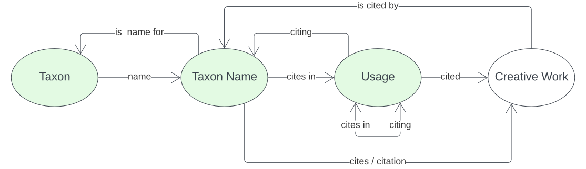

= National Species List - Model
:Title: National Species List - Model
:titletext: {title}
:doctype: book
:encoding: utf-8
:lang: en
:table-stripes: even
:toc: left
:toclevels: 3
:chapter-label:
:sectnums:
:sectnumlevels: 4
:sectanchors:
:figure-id: 0
:table-id: 0
:req-id: 0
:rec-id: 0
:per-id: 0
:xrefstyle: short
:source-highlighter: rouge

[#overview]
.An informal overview of this data model

== Metadata

[width="50%", cols="1,2"]
|===
| Property | Value

| IRI | https://linked.data.gov.au/def/nsl
| Name | National Species List - Model
| Version | 1.0.0
|===

include::01-abstract.adoc[]

include::02-preamble.adoc[]

include::03-intro.adoc[]

include::04-patterns.adoc[]

include::05-model.adoc[]

include::98-mappings.adoc[]

include::99-references.adoc[]