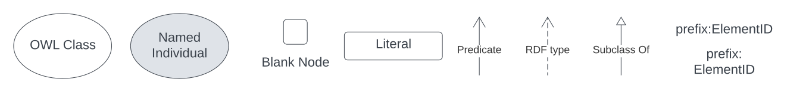

== Preamble

=== Terms & Definitions

[discrete]
==== IRI

An _Internationalized Resource Identifier_ is a web address-style URL that is used as an identifier for something. It may be for a real-world object, e.g. `https://linked.data.gov.au/dataset/qldgeofeatures/AnakieProvince` identifies the Queensland Geological Feature _Anakie Province_ or for data only, e.g. `https://schema.org/marginOfError` which is for a predicate that links a margin of error value to a result.

IRIs do not have to resolve - go somewhere online when clicked - but they do have to follow ll the rules for URLs such as having no spaces.

[discrete]
==== Class

Within formal <<OWL, OWL>> modelling a class is a set of objects exhibiting common properties. For example, the set of all people who are studying could be defined as being within a _Student_ class.

[discrete]
==== OWL

The OWL 2 Web Ontology Language, informally OWL 2, is an ontology language for the Semantic Web with formally defined meaning. OWL 2 ontologies provide classes, properties, individuals, and data values and are stored as Semantic Web documents. OWL 2 ontologies can be used along with information written in RDF, and OWL 2 ontologies themselves are primarily exchanged as RDF documents. <<OWL2, OWL>>

[discrete]
==== Predicate

Predicates, within formal <<OWL, OWL>> modelling, are the defined relations between objects of different classes (see <<Class>>) and also between objects and simple data values such as numbers and dates. For example, if _Person X_ "knows" _Person Y_, then we can use a predicate of `knows` to relate them.

Frequently we use predicates already defined in existing ontologies. "knows", for example, is defined in the schema.org ontology <<SDO, SDO>> to be "The most generic bi-directional social/work relation".

[discrete]
==== RDF

The Resource Description Framework (RDF) is a framework for representing information on the Web. RDF graphs are sets of subject-predicate-object triples, where the elements may be IRIs, unidentified nodes, or literals with specific datatypes. RDF expresses descriptions of resources. <<RDFSPEC, RDFSPEC>>

[discrete]
==== RDFS

RDF Schema provides a data-modelling vocabulary for RDF data. RDF Schema is an extension of the basic RDF vocabulary. <<RDFS, RDFS>>

[discrete]
==== SPARQL

SPARQL is a query language for RDF. The results of SPARQL queries can be result sets or RDF graphs. <<SPARQL, SPARQL>>

=== Diagram Conventions

The following elements are used in Conceptual and Logical model diagrams:

.Diagram Elements Key. Where `prefix:ElementID` is used, the `prefix` refers to entries in the <<Namespaces, Namespaces>> table below

=== Namespaces

Namespaces for model, vocabulary and validator elements are assigned the following prefixes:

[frame=none, grid=none, cols="1, 4, 4"]
|===
| `biro` | http://purl.org/spar/biro/ | http://www.sparontologies.net/ontologies/biro[BiRO], the Bibliographic Reference Ontology
| `ex`: | http://example.com/ | A non-resolving namespace for examples
| `nsl`: | https://linked.data.gov.au/def/nsl | This data model's namespace
| `owl`: | http://www.w3.org/2002/07/owl# | <<OWL2, OWL>> ontology
| `prov`: | http://www.w3.org/ns/prov# | <<PROV, PROV>> ontology
| `rdfs`: | http://www.w3.org/2000/01/rdf-schema# | <<RDFS, RDFS>> ontology
| `sdo`: | https://schema.org/ | <<SDO, SDO>> vocabulary
| `skos`: | http://www.w3.org/2004/02/skos/core# | <<SKOS, SKOS>> ontology
| `sosa`: | http://www.w3.org/ns/sosa/ | <<SOSA, SOSA>> ontology
| `xsd`: | http://www.w3.org/2001/XMLSchema# | <<XSD2, XSD>> datatypes vocabulary
|===
