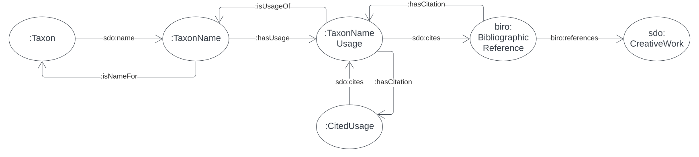

== Model

This section defines not only this model but also the background models this model inherits from and how they are formally related.

[#fig-classes-and-predicates,link=../img/classes-and-predicates.svg]
.A formal overview of the auNSL OWL Data Model showing major Classes and Predicates. This figure extends Figure 3.

=== NSL Model

=== Background Models

=== Profile Definition

The relations of this model to the Background Models it inherits from are given in _Profiles Vocabulary_ <<PROF>> terms in a formal "profile definition". That definition is related here in human-readable form and in machine-readable form (RDF) at:

* https://linked.data.gov.au/def/nsl/profile

#TODO: write up profile definition#