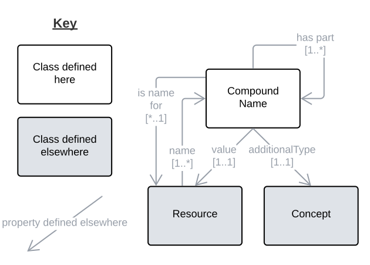
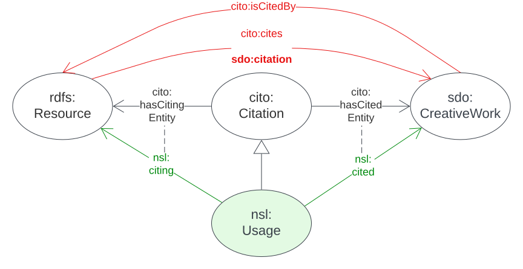

== Patterns

Patterns are arrangements of elements of a model designed for some purpose. This model implements patterns inherited from other models and also implements some of its own patterns or extends those inherited. The following patterns are important patterns to understand when using this model.

=== Qualified Relations

In graph modelling, as per <<RDF, RDF>> and <<OWL, OWL>>, objects are associate with binary relations which are _unqualified_. For example, a `<<sdo:CreativeWork, Creative Work>>`, such as a book, might be attributed to multiple `<<sdo:Person, Person>>` instances like this:

----
ex:book-001
    a sdo:CreativeWork ;
    prov:wasAttributedTo
        ex:person-a ,
        ex:person-b ;
.
----

In this example, we have no knowledge of what the role of `ex:person-a` or `ex:person-b` was/is with respect to the book `ex:book-001`.

We can use specialised predicates to indicate roles. Building on the example above we might have:

----
ex:book-001
    a sdo:CreativeWork ;
    dcterms:author ex:person-a ;
    dcterms:editor ex:person-b ;
.
----

Now we can see the different roles played by the persons - "author" and "editor" - but this is limied to a defined set of predicates.

Instead, we can use the _qualified relation_ pattern (see https://patterns.dataincubator.org/book/qualified-relation.html[ref]) that interposes a node (data object) between the two related objects - a book and a person - and attached qualifying information to that node. Using this pattern, the above example could be represented like this:

----
ex:book-001
    a sdo:CreativeWork ;
    prov:qualifiedAttribution [
        prov:agent ex:person-a ;
        prov:hadRole ex:author ;
    ] ,
    [
        prov:agent ex:person-b ;
        prov:hadRole ex:editor ;
    ] ;
.
----

Here, the same information is conveyed as in the previous example however the roles - "author" & "editor" - can be defined in an expandable, or even multiple, vocabularies of terms and do not need to be drawn from a ontology containing predicates. This make the expansion and even alteration of roles much easier.

For a `<<nsl:TaxonName, TaxonName>>` object, multiple usages - instances of `<<nsl:Usage, Usage>>` - are likely to exist and it is important to indicate which of them is the "accepted use". If no qualified relations are used, this model's predicate `<<nsl:isCitedBy, nsl:isCitedBy>>` can be used to relate the objects, but they cannot be differentiated, like this:

----
<http://example.com/taxonName/94766>
    a nsl:TaxonName ;
    nsl:isCitedBy
        <http://example.com/usage/22532> ,
        <http://example.com/usage/518366> ,  # accepted use
        <http://example.com/usage/720941> ,
        # ...
.
----

If the _qualified relation_ pattern is used, the role of the `<<nsl:Usage, Usage>>` - "accepted" or otherwise - can be seen:

----
<http://example.com/taxonName/94766>
    a nsl:TaxonName ;
    nsl:qualifiedCitation [
        sdo:value <http://example.com/usage/22532> ;
        sdo:roleName ex:archaicUse ;
    ] ,
    [
        sdo:value <http://example.com/usage/518366> ;
        sdo:roleName ex:acceptedUse ;
    ] ,
    [
        sdo:value <http://example.com/usage/720941> ;
        sdo:roleName ex:archaicUse ;
    ] ,
    # ...
.
----

This _qualified relation_ pattern representation of name usage can include temporal details like this:

----
<http://example.com/taxonName/94766>
    a nsl:TaxonName ;
    nsl:qualifiedCitation [
        sdo:value <http://example.com/usage/22532> ;
        sdo:roleName ex:archaicUse ;
        time:hasTime [
            time:hasBeginning [ time:inXSDDateTime "1927-05-14" ] ;
            time:hasEnd [ time:inXSDDateTime "1985-07-12" ] ;
        ] ;
    ] ,
    [
        sdo:value <http://example.com/usage/518366> ;
        sdo:roleName ex:acceptedUse ;
        time:hasTime [
            time:hasBeginning [ time:inXSDDateTime "1985-07-12" ] ;
        ] ;
    ] ,
    [
        sdo:value <http://example.com/usage/720941> ;
        sdo:roleName ex:archaicUse ;
    ] ,
    # ...
.
----

In the above example, two `<<nsl:Usage, Usage>>` instances are indicated as having the role of "accepted", but they are further qualified with temporal extents meaning that there has not been more than one "accepted" use here.

=== Compound Names

This model represents complex names made of multiple parts for various sorts of objects. Important examples of which are described in the following table.

[cols="1,2,2,2"]
|===
| Complex Name | Description | Format | Example

| *scientific name* | a Genus and a Species name uniquely identifying a `Taxon` instance | `{GENUS-NAME} {SPECIES-NAME}` | "Lomatia ilicifolia"
| *scientific name with authorship* | a Genus and Species name with an abbreviated author name uniquely identifying a `Taxon Name` instance | `{GENUS-NAME} {SPECIES-NAME} {AUTHOR-NAME-ABBREVIATED}` a| "Lomatia ilicifolia R.Br."

_Lomatia ilicifolia_ as named by Brown, R.
| *scientific name with authorship as per publication* | a Genus and Species name with an abbreviated author name and publication reference uniquely identifying a `Taxon Name Usage` instance | `{GENUS-NAME} {SPECIES-NAME} {AUTHOR-NAME-ABBREVIATED} sensu {PUBLICATION-NAME-ABBREVIATED} a| "Lomatia ilicifolia R.Br. sensu ABRS"

_Lomatia ilicifolia_, as named by Brown, R and used in the Australian Biological resources Study's _Flora of Australia_ publication
|===

The pattern used to represent the parts of these compound names and to assemble the parts and format them is taken from the <<CN, Compound Naming Model>>, an overview figure of which is shown below.

[#fig-cn,link=../img/cn.svg]
.Compound Naming Model overview figure

The Compound Naming Model, as overviewed in the figure above, allows for the creation of `Compound Name` objects which just present a resource - a simple data object like text, a number or date or a complex object which can be any kind of object - with an "additional type" or specialised type for that resource which defines its role. Templating used per Compound Name object to define the printing format of the resource's textual representation is defined in the Model but is outside RDF representation.

A recursive algorithm which gathers simple data objects from Compound Name objects that refer to other Compound Name objects is also given in the Model. The algorithm allows a textual representation of any Compound Name object to be created, even when the object has other Compound Name objects as its parts to any level of depth. The algorithm extracts the textual representation of any object and presents it to any other object referencing it so that textual representations can be compounded "upwards" to the level it is needed.

Scientific names can be represented as a very simple Compound Name objects as follows:

----
ex:name-lomatia
    a cn:CompoundName ;
    sdo:value "Lomatia" ;
    sdo:additionalType ex:genus ;
.

ex:name-ilicifolia
    a cn:CompoundName ;
    sdo:value "ilicifolia" ;
    sdo:additionalType ex:species ;
.

ex:scientific-name-lomatia-ilicifolia
    a cn:CompoundName ;
    sdo:hasPart
        ex:name-lomatia ,
        ex:name-ilicifolia ;
    sdo:additionalType ex:scientificName ;
.
----

The templates for the three specialised types of `CompoundName`s above are then:

[cols="1,2,1"]
|===
| Object | Template | Example

| `ex:genus` | `{VALUE}\|italic` | _Lomatia_
| `ex:species` | `{VALUE}\|italic` | _ilicifolia_
| `ex:scientificName` | `{ex:genus->VALUE} {ex:species->VALUE}` | _Lomatia ilicifolia_
|===

Similar data representation and templating can then be used for _scientific name with authorship_ and all other naming.

=== Citations

Many models - Semantic Web models and others - have patterns for indicating referencing or citation. For example, <<SDO, schema.org>> includes a predicate `<<sdo:citation, citation>> - that can be used to associate a _citing_ and a _cited_ object, like this:

----
ex:highschool-essay-x
    a sdo:CreativeWork ;
    sdo:citation ex:frankenstein ;
.

ex:frankenstein
    a sdo:CreativeWork ;
    sdo:name "Frankenstein; or, The Modern Prometheus" ;
    sdo:author "Mary Shelley" ;
.
----

This simple form of citation does not cater for qualification of the citation (see the <<Qualified Relations, Qualified Relations section>> above) or for the indication or part citation: which part of _Frankenstein_ was cited.

Detailed citation models handle these issues and the <<CITO, Citation Typing Ontology (CiTO)>> model which interposes a `Citation` object between the _citing_ and a _cited_ objects, following the <<Qualified Relations, Qualified Relations>> pattern to which qualifying details can be related, like this:

----
ex:citation-x
    a cito:Citation ;
    cito:hasCitingEntity ex:highschool-essay-x ;  # the citing work
    cito:hasCitedEntity ex:frankenstein ;  # the cited work
    cito:hasCitationCharacterization cito:critiques ;
.
----

Here `ex:highschool-essay-x` cited `ex:frankenstein` in the manner of a critique - `cito:critiques`.

In this model, we adopt the CITO cited/citing pattern with renamed predicates of `cito:hasCitingEntity` -> `nsl:citing` and `cito:hasCitedEntity` -> `nsl:cited` and make an equivalence to the unqualified citation pattern of schema.org whereby the predicate path `sdo:citation` == (inverse of) `cito:hasCitingEntity` / `cito:hasCitedEntity`, as per the following figure:

[#fig-citation,link=../img/citation.svg]
.CITO's citation patten adapted with red predicates inferred and green predicates created here as equivalents

The representation of citation of specific parts of a cited work are not provided for directly by CITO but are partly support by the use of in-text reference pointers in the CITO sibling ontology http://www.sparontologies.net/ontologies/c4o[C4O] able to be indicated. Another CITO sibling ontology, http://www.sparontologies.net/ontologies/doco[DOCO], provides for detailed document part modelling which allows citations to indicate a part of a document (a `Creative Work`) but only if that document has been decomposed into addressable parts.

The reasonably well-known (in ontology circles) https://www.dublincore.org/specifications/bibo/[BIBO] ontology for "expressing citations and bibliographic references" allows for standard scholarly citation element representation: page numbers, journal volumes and so on.

Using the altered citation pattern, described above, as well as model elements from BIBO, we can model NSL `<<nsl:Usage, Usage>>` instances like this:

----
# indicating the use of Taxon Name No. 94766
# on page 200 of Creative Work No. 22456
ex:tn-518366
    a nsl:Usage ;
    nsl:citing ex:taxonName-94766 ;
    nsl:cited ex:creativeWork-22456 ;
    bibo:pages 200 ;
.

# inference drawn from above
ex:taxonName-94766 sdo:citation ex:creativeWork-22456 .
----

The _citing_ and _cited_ objects may vary: `TaxonName` instances but also other `Usage` instances may be cited.
