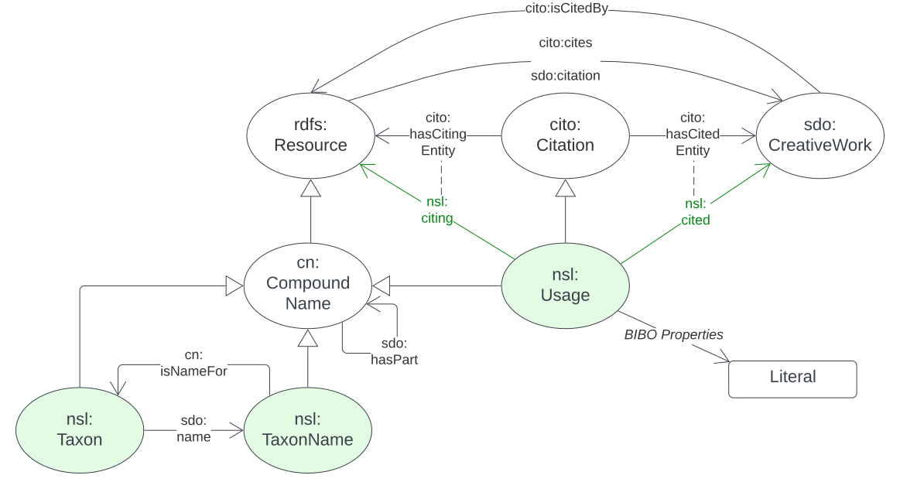

== Model

This section details not only model elements defined in this model but also model elements defined elsewhere and used in this model.

=== auNSL Semantic Web Model

[#fig-owl,link=../img/owl.svg]
.A formal overview of the auNSL Semantic Web Model showing <<Class, Classes>> and <<Predicate, Predicates>> with the Classes defined by this model in green and those inherited from elsewhere in white using notation described in the <<Diagram Conventions, Diagram Conventions section>> . Namespace prefixes for each figure element are given such as ":" & "sdo:" so elements' full IRIs can be understood. See the <<Namespaces, Namespaces>> section for their interpretation. This figure extends <<fig-overview>> above.

#TODO: add the real comprehensive figure in above#

==== Classes

===== Class Index

* <<nsl:Taxon, Taxon>>
* <<nsl:TaxonName, Taxon Name>>
* <<nsl:Usage, Usage>>
* <<sdo:CreativeWork, Creative Work>>
* <<cn:CompoundName, Compound Name>>
* <<cito:Citation, Citation>>
* <<rdfs:Resource, Resource>>

[[nsl:Taxon]]
===== Taxon

[cols="2,7"]
|===
| Property | Value

| IRI | `nsl:Taxon`
| Preferred Label | Taxon
| Definition | A group of organisms considered by taxonomists to form a homogeneous unit
| Is Defined By | This model
| Provenance | Built on the https://ontobee.org/ontology/OBI[Ontology for Biomedical Investigation]'s definition for http://purl.obolibrary.org/obo/OBI_0100026[Organism]
| Subclass of | https://www.w3.org/TR/prov-o/#Entity[`prov:Entity`]
| Equivalent Class | The https://linkeddata.tern.org.au/information-models/tern-ontology[TERN Ontology]'s https://w3id.org/tern/ontologies/tern/Taxon[`tern:Taxon`] class
| Expected Properties | <<sdo:name, name>>
| Example
a| [source,turtle]
----
PREFIX cn: <https://linked.data.gov.au/def/cn/>
PREFIX ex: <http://example.com/>
PREFIX nsl: <https://linked.data.gov.au/def/nsl/>
PREFIX sdo: <https://schema.org/>

<https://id.biodiversity.org.au/51851883>
    a nsl:Taxon ;
    sdo:name <https://id.biodiversity.org.au/name/afd/83727> ;  # a Taxon Name
.
----
|===

[[nsl:TaxonName]]
===== Taxon Name

[cols="2,7"]
|===
| Property | Value

| IRI | `nsl:TaxonName`
| Preferred Label | Taxon Name
| Definition | A name applied to Taxa by people at a point in time
| Is Defined By | This model
| Provenance | Defined by the NSL team
| Subclass of | <<cn:CompoundName, Compound Name>>
| Expected Properties | <<cn:isNameFor>>, <<sdo:hasPart>>, <<sdo:citation>>
| Example
a| [source,turtle]
----
PREFIX cn: <https://linked.data.gov.au/def/cn/>
PREFIX ex: <http://example.com/>
PREFIX nsl: <https://linked.data.gov.au/def/nsl/>
PREFIX nslnames: <https://linked.data.gov.au/def/nsl/names/>
PREFIX sdo: <https://schema.org/>

ex:name-lomatia
    a cn:CompoundName ;
    sdo:value "Lomatia" ;
    sdo:additionalType ex:genus ;
    # template: "{ex:genus}"
.

ex:name-ilicifolia
    a cn:CompoundName ;
    sdo:value "ilicifolia" ;
    sdo:additionalType ex:species ;
    # template: "{ex:species}"
.

ex:author-1441
    a cn:CompoundName ;
    sdo:hasPart [
        sdo:value "Brown" ;
        sdo:additionalType ex:familyName ;
    ] ,
    [
        sdo:value "Robert" ;
        sdo:additionalType ex:givenName ;
    ] ,
    [
        sdo:value "R.Br." ;
        sdo:additionalType ex:authorStandardForm ;
    ] ;
    sdo:additionalType ex:species ;
    # template: "{ex:authorStandardForm}"
.

ex:name-94766
    a cn:CompoundName ;
    sdo:hasPart [
        sdo:value ex:name-lomatia ;
        sdo:additionalType ex:genus ;
    ] ,
    [
        sdo:value ex:name-ilicifolia ;
        sdo:additionalType ex:species ;
    ] ,
    [
        sdo:value ex:author-1441 ;
        sdo:additionalType ex:author ;
    ] ;
    sdo:additionalType ex:scientificName ;
    # template: "{ex:genus} {ex:species} {ex:author}"
.
----
|===

[[nsl:Usage]]
===== Usage

[cols="2,7"]
|===
| Property | Value

| IRI | `nsl:Usage`
| Preferred Label | Taxon Name Usage
| Definition | An instance of the use of an Entity via citation
| Is Defined By | This model
| Provenance | Defined by the NSL team
| Subclass of | http://www.sparontologies.net/ontologies/cito[Citation] , http://www.sparontologies.net/ontologies/biro[Bibliographic Reference]
| Expected Properties | <<nsl:citing, citing>>, <<nsl:cited, cited>>, https://www.dublincore.org/specifications/bibo/[BIBO] referencing properties
| Example
a| [source,turtle]
----
PREFIX bibo: <http://purl.org/ontology/bibo/>
PREFIX ex: <http://example.com/>
PREFIX nsl: <https://linked.data.gov.au/def/nsl/>
PREFIX prov: <http://www.w3.org/ns/prov#>
PREFIX sdo: <https://schema.org/>
PREFIX xsd: <http://www.w3.org/2001/XMLSchema#>

ex:tn-518366
    a nsl:Usage ;
    nsl:citing ex:taxonName-94766 ;  # a Taxon Name instance
    nsl:cited ex:creativeWork-22456 ;  # a Creative Work instance
    bibo:pages 200 ;
.
----
|===

[[sdo:CreativeWork]]
===== Creative Work

[cols="2,7"]
|===
| Property | Value

| IRI | `sdo:CreativeWork`
| Preferred Label | Creative Work
| Definition | The most generic kind of creative work, including books, movies, photographs, software programs, etc.
| Is Defined By | https://schema.org[schema.org]
| Provenance | Used without change
| Expected Properties | Standard predicates for the cataloguing of scholarly works
| Example
a| [source,turtle]
----
PREFIX cn: <https://linked.data.gov.au/def/cn/>
PREFIX ex: <http://example.com/>
PREFIX sdo: <https://schema.org/>
PREFIX xsd: <http://www.w3.org/2001/XMLSchema#>

<http://hdl.handle.net/102.100.100/314652>
    a sdo:CreativeWork ;  # sdo:Article
    sdo:name "Check List of Northern Territory Plants" ;
    sdo:author "Chippendale, G.M." ;
    sdo:datePublished "1972-04-17"^^xsd:date ;
    ex:publicationName "Proceedings of the Linnean Society of New South Wales" ;
    sdo:volumeNumber 64 ;
    sdo:issueNumber 4 ;
    sdo:name [
        # "Chippendale, G.M. (17 April 1972), Check List of Northern Territory Plants. Proceedings of the Linnean Society of New South Wales 96(4)" ;
        a cn:CompoundName ;
        sdo:hasPart [
            sdo:additionalType sdo:name ;
            sdo:value "Check List of Northern Territory Plants" ;
        ] ,
        [
            sdo:additionalType sdo:author ;
            sdo:value "Chippendale, G.M." ;
        ] ,
        [
            sdo:additionalType sdo:datePublished ;
            sdo:value "1972-04-17"^^xsd:date ;
        ] ,
        [
            sdo:additionalType ex:publicationName ;
            sdo:value "Proceedings of the Linnean Society of New South Wales" ;
        ] ,
        [
            sdo:additionalType sdo:volumeNumber ;
            sdo:value 64 ;
        ] ,
        [
            sdo:additionalType sdo:issueNumber ;
            sdo:value 4 ;
        ]
    ]
.
----
|===

[[cn:CompoundName]]
===== Compound Name

[cols="2,7"]
|===
| Property | Value

| IRI | `cn:CompoundName`
| Preferred Label | Compound Name
| Definition | A Compound Name is a literal value, or objects that can be interpreted as literal values, that describe or name a Feature
| Is Defined By | https://linked.data.gov.au/def/cn[Compound Naming Model]
| Provenance | Used via subclasses (<<nsl:TaxonName, TaxonName>>)
| Expected Properties | <<cn:isNameFor>>, <<sdo:hasPart>>
| Scope Note | This class is not expected to be used directly, instead use <<nsl:TaxonName, Taxon Name>>
| Example | See the example for <<nsl:TaxonName, Taxon Name>> and the <<Compound Names, Compound Names pattern>>.
|===

[[cito:Citation]]
===== Citation

[cols="2,7"]
|===
| Property | Value

| IRI | `cito:Citation`
| Preferred Label | Citation
| Definition | A conceptual directional link from a citing entity to a cited entity
| Is Defined By | <<CITO, CIO>>
| Provenance | Used via subclasses (<<nsl:Usage, Usage>>)
| Expected Properties | <<nsl:citing, citing>>, <<nsl:cited, cited>>
| Scope Note | This class is not expected to be used directly, instead use <<nsl:Usage, Usage>>
| Example | See the example for <<nsl:Usage, Usage>> and the <<Citation, Citation pattern>>.
|===

[[rdfs:Resource]]
===== Resource

[cols="2,7"]
|===
| Property | Value

| IRI | `rdfs:Resource`
| Preferred Label | Resource
| Definition | The class resource, everything
| Is Defined By | <<RDFSSPEC, RDFS>>
| Provenance | Used only via subclassing (<<cn:CompoundName, Compound Name>>, <<sdo:CreativeWork, Creative Work>>)
| Expected Properties | None
| Scope Note | This class is not expected to be used directly, instead use specialised subclasses
| Example | No example given as all use is via subclasses
|===

==== Predicates

===== Class Index

* <<sdo:name, name>>
* <<cn:isNameFor, is name for>>
* <<sdo:hasPart, has part>>
* <<nsl:citing, citing>>
* <<nsl:cited, cited>>
* <<cito:cites, cites>>
* <<cito:isCitedBy, is cited by>>
* <<sdo:citation, citation>>

[[sdo:name]]
===== name

[[cn:isNameFor]]
===== is name for

[[sdo:hasPart]]
===== has part

[[nsl:citing]]
===== citing

[[nsl:cited]]
===== cited

[[cito:cites]]
===== cites

[[cito:isCitedBy]]
===== is cited by

[[sdo:citation]]
===== citation

=== Background Models

=== Profile Definition

The relations of this model to the Background Models it inherits from are given in _Profiles Vocabulary_ <<PROF>> terms in a formal "profile definition". That definition is related here in human-readable form and in machine-readable form (RDF) at:

* https://linked.data.gov.au/def/nsl/profile

#TODO: write up profile definition#