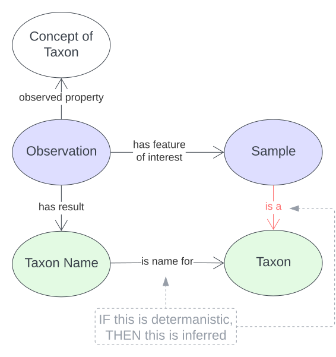

== Mappings

This section contains mappings of this model to other models/vocabularies.

////
Darwin Core https://dwc.tdwg.org/
TDWG’s TCS https://github.com/tdwg/tcs2
Catalogue of Life https://github.com/CatalogueOfLife/coldp#schema
World Flora Online https://list.worldfloraonline.org/
////

=== ABIS

The BDR dataset uses the <<ABIS, ABIS>> model which contains uses the same `Taxon` and `Taxon Name` classes as defined in this model as well as the `Bibliographic Reference` and `Creative Work` classes and `cites` & `references` predicates this model also reuses for general-purpose modelling. The use of the `Taxon` and `Taxon Name` classes by ABIS is shown in the following figure.

[#fig-abis,link=../img/abis.svg]
.Classes from the <<SOSA, SOSA>> ontology used by <<ABIS, ABIS>>, shown in blue, and how they relate to classes defined by this model, shown in green. ABIS _observes_ samples (animals, plants, parts of plants, soil etc.) and declares that a `Sample` belongs to ("is a") `Taxon` or has a particular `Taxon Name` assigned to it.

This information is repeated in the <<Related Domain Models, Related Domain Models>> subsection of the <<Introduction, Introduction Section>> of this document.

=== GBIF New Data Model

[cols="1,1,1,3"]
|===
| From Element | Mapping relation | To Element | Notes

|===

=== Darwin Core

[cols="1,1,1,3"]
|===
| From Element | Mapping relation | To Element | Notes

|===

=== Taxon Concept Schema

[cols="1,1,1,3"]
|===
| From Element | Mapping relation | To Element | Notes

|===

=== Catalogue of Life

[cols="1,1,1,3"]
|===
| From Element | Mapping relation | To Element | Notes

|===

=== World Flora Online

=== Atlas of Living Australia